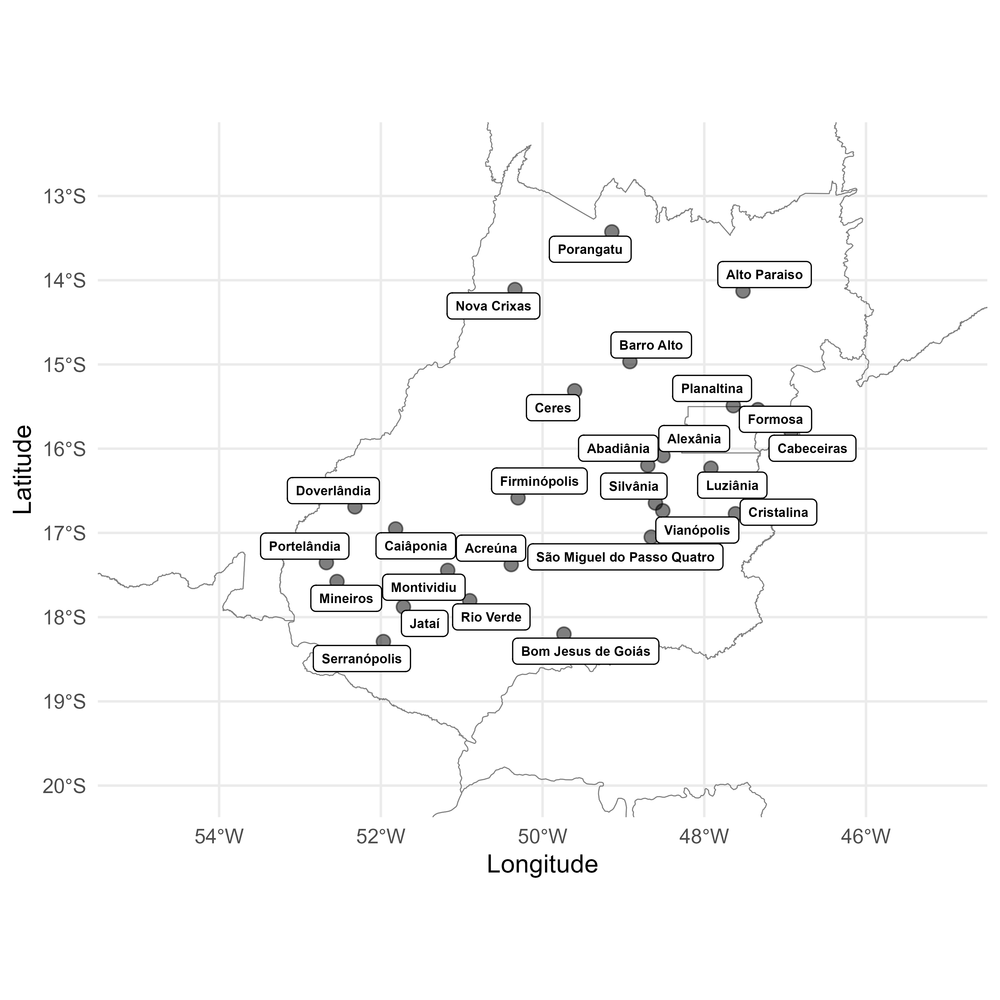

# About

 

The purpose of this study was to perform the first search of identification in scale-large of plant-parasitic nematodes, estimate the spatial heterogeneity and predict the probability of occurrence and reach the damage threshold of the morphological group specifics in tropical region from the influence of different environmental and cultural variables. Our study was carried out in the predominant ecosystem, the Cerrado, exhibits diverse vegetation formations, ranging from open grasslands to dense forests